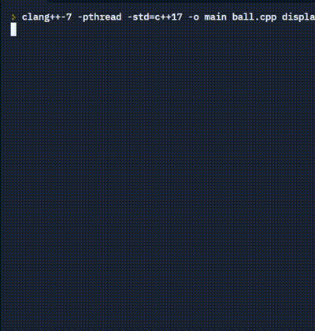

# ASCII-Bouncing-Ball

**Written in C++**

The ASCII Bouncing Ball in the console with physics

You can download this repo and run it on your own machine.
Or try it in online compiler: https://replit.com/@sulrz/bouncing-ball#main.cpp

